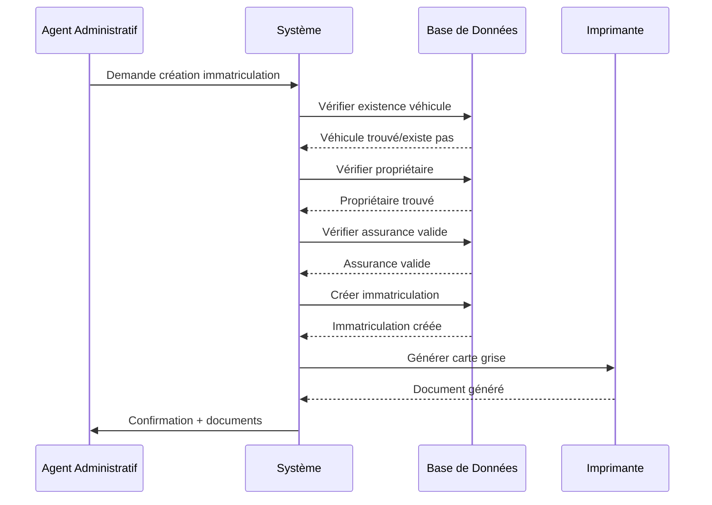
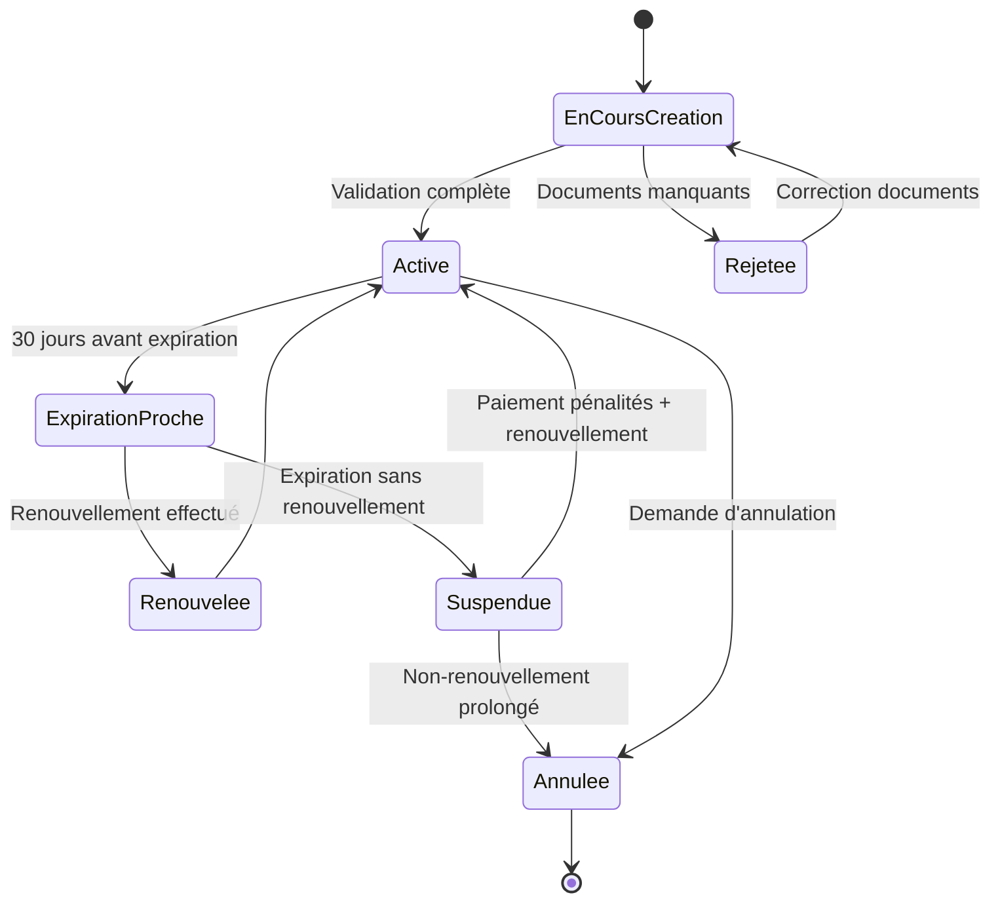
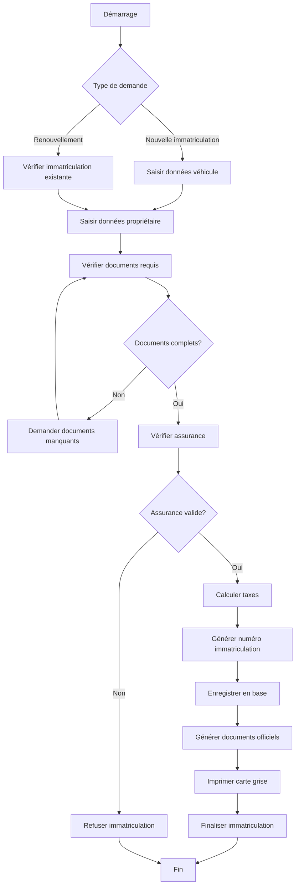
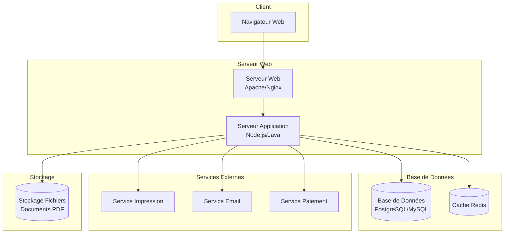

# Système de Gestion d'Immatriculation des Véhicules et des Motos

---

## CAHIER DES CHARGES

### 1. Contexte et Objectifs

**Contexte :**
Le système de gestion d'immatriculation des véhicules et des motos est une application informatique destinée aux services administratifs (Préfecture, Sous-Préfecture, Centers de gestion administratif) pour gérer l'enregistrement, le suivi et la gestion des immatriculations de tous types de véhicules motorisés.

**Objectifs principaux :**
- Centraliser la gestion des immatriculations des véhicules et des motos
- Assurer le suivi complet du cycle de vie d'une immatriculation (création, renouvellement, résiliation)
- Gérer les données des propriétaires, conducteurs et assurances
- Générer des rapports et statistiques
- Faciliter les recherches et consultations des dossiers

---

### 2. Acteurs du Système

| Acteur | Rôle |
|--------|------|
| **Agent administratif** | Crée, modifie et gère les immatriculations |
| **Propriétaire du véhicule** | Consulte son dossier et les documents importants |
| **Inspecteur technique** | Effectue les contrôles techniques et valide les immatriculations |
| **Responsable d'agence** | Supervise et valide les dossiers importants |
| **Auditeur/Statisticien** | Consulte les rapports et statistiques |

---

### 3. Exigences Fonctionnelles

#### 3.1 Gestion des Véhicules
- [x] Enregistrer un nouveau véhicule avec ses caractéristiques
- [x] Distinguer les types de véhicules (Voiture, Moto, Camion, etc.)
- [x] Associer un numéro d'immatriculation unique
- [x] Mettre à jour les informations du véhicule
- [x] Archiver un véhicule (fin d'exploitation)
- [x] Consulter l'historique des modifications

#### 3.2 Gestion des Propriétaires et Conducteurs
- [x] Enregistrer les propriétaires avec leurs données personnelles
- [x] Gérer les conducteurs autorisés
- [x] Associer plusieurs propriétaires à un même véhicule (co-propriété)
- [x] Gérer les changements de propriétaires (transferts)
- [x] Conserver l'historique des propriétaires

#### 3.3 Gestion des Immatriculations
- [x] Créer une nouvelle immatriculation avec tous les documents requis
- [x] Renouveler une immatriculation existante
- [x] Mettre en place des pénalités pour immatriculations expirées
- [x] Générer les documents officiels (carte grise, certificat d'immatriculation)
- [x] Archiver les immatriculations

#### 3.4 Gestion des Assurances
- [x] Enregistrer les polices d'assurance
- [x] Suivre les dates d'expiration des assurances
- [x] Vérifier la validité de l'assurance avant immatriculation

#### 3.5 Gestion des Contrôles Techniques
- [x] Planifier les contrôles techniques
- [x] Enregistrer les résultats des contrôles
- [x] Signaler les défauts relevés
- [x] Tracker le suivi des corrections

#### 3.6 Gestion des Rapports
- [x] Génération de rapports statistiques
- [x] Suivi par type de véhicule
- [x] Suivi par région/agence
- [x] Données sur les immatriculations expirées

---

### 4. Exigences Non-Fonctionnelles

| Exigence | Description |
|----------|-------------|
| **Sécurité** | Authentification, autorisation basée sur les rôles, chiffrement des données sensibles |
| **Performance** | Temps de réponse < 2 secondes pour les recherches |
| **Disponibilité** | 99% de disponibilité durant les heures de travail |
| **Intégrité** | Piste d'audit complète, sauvegarde régulière |
| **Scalabilité** | Support de 100 000+ véhicules |
| **Accessibilité** | Interface ergonomique et accessible |

---

### 5. Contraintes Techniques

- Système web basé sur une architecture client-serveur
- Base de données relationnelle (PostgreSQL/MySQL)
- Respect des normes de sécurité gouvernementales
- Compatible avec les navigateurs modernes
- Backup automatique quotidien

---

## MODÉLISATION UML

### Diagramme de Classes

```mermaid
classDiagram
    class Vehicule {
        +id: int
        +numeroImmatriculation: string
        +marque: string
        +modele: string
        +anneeFabrication: int
        +couleur: string
        +numeroSerie: string
        +typeVehicule: TypeVehicule
        +dateEnregistrement: Date
        +statut: StatutVehicule
        +creerVehicule()
        +modifierVehicule()
        +archiverVehicule()
    }

    class TypeVehicule {
        <<enumeration>>
        VOITURE
        MOTO
        CAMION
        BUS
        UTILITAIRE
    }

    class StatutVehicule {
        <<enumeration>>
        ACTIF
        ARCHIVE
        SUSPENDU
    }

    class Proprietaire {
        +id: int
        +nom: string
        +prenom: string
        +dateNaissance: Date
        +adresse: Adresse
        +numeroTelephone: string
        +email: string
        +numeroPermis: string
        +dateObtentionPermis: Date
        +creerProprietaire()
        +modifierProprietaire()
    }

    class Adresse {
        +rue: string
        +ville: string
        +codePostal: string
        +pays: string
    }

    class Immatriculation {
        +id: int
        +numeroImmatriculation: string
        +dateCreation: Date
        +dateExpiration: Date
        +statut: StatutImmatriculation
        +documentsRequis: List<Document>
        +creerImmatriculation()
        +renouvelerImmatriculation()
        +annulerImmatriculation()
    }

    class StatutImmatriculation {
        <<enumeration>>
        ACTIVE
        EXPIREE
        SUSPENDUE
        ANNULEE
    }

    class Assurance {
        +id: int
        +numeroPolice: string
        +compagnieAssurance: string
        +dateDebut: Date
        +dateFin: Date
        +montantCouverture: decimal
        +typeCouverture: string
        +creerAssurance()
        +verifierValidite()
    }

    class ControleTechnique {
        +id: int
        +dateControle: Date
        +resultat: ResultatControle
        +defautsReleves: List<string>
        +dateProchainControle: Date
        +effectuerControle()
        +corrigerDefauts()
    }

    class ResultatControle {
        <<enumeration>>
        REUSSI
        ECHEC
        AJOURNE
    }

    class AgentAdministratif {
        +id: int
        +nom: string
        +prenom: string
        +role: RoleAgent
        +agence: Agence
        +creerImmatriculation()
        +validerDocuments()
        +genererRapport()
    }

    class RoleAgent {
        <<enumeration>>
        AGENT_SIMPLE
        SUPERVISEUR
        ADMINISTRATEUR
    }

    class Agence {
        +id: int
        +nom: string
        +adresse: Adresse
        +region: string
        +gererImmatriculations()
    }

    class Rapport {
        +id: int
        +typeRapport: TypeRapport
        +dateGeneration: Date
        +donnees: Map<string, Object>
        +genererRapport()
        +exporterRapport()
    }

    class TypeRapport {
        <<enumeration>>
        STATISTIQUE_VEHICULES
        STATISTIQUE_REGION
        RAPPORT_EXPIRATION
        RAPPORT_CONTROLES
    }

    Vehicule --> TypeVehicule
    Vehicule --> StatutVehicule
    Proprietaire --> Adresse
    Immatriculation --> StatutImmatriculation
    ControleTechnique --> ResultatControle
    AgentAdministratif --> RoleAgent
    AgentAdministratif --> Agence
    Rapport --> TypeRapport

    Vehicule ||--o{ Immatriculation : possède
    Vehicule ||--o{ Proprietaire : appartient_à
    Vehicule ||--o{ Assurance : assuré_par
    Vehicule ||--o{ ControleTechnique : soumis_à
    Immatriculation --> Proprietaire : délivrée_à
    Assurance --> Proprietaire : souscrite_par
    ControleTechnique --> AgentAdministratif : effectué_par
    Rapport --> AgentAdministratif : généré_par
    Agence --> Vehicule : gère
```

### Diagramme de Cas d'Utilisation

```mermaid
graph TD
    A[Agent Administratif] --> B[Créer Immatriculation]
    A --> C[Renouveler Immatriculation]
    A --> D[Consulter Dossier Véhicule]
    A --> E[Gérer Propriétaires]
    A --> F[Gérer Assurances]
    A --> G[Planifier Contrôles Techniques]
    A --> H[Générer Rapports]

    I[Propriétaire] --> J[Consulter Ses Véhicules]
    I --> K[Télécharger Documents]

    L[Inspecteur Technique] --> M[Enregistrer Résultats Contrôle]
    L --> N[Valider Immatriculation]

    O[Responsable d'Agence] --> P[Superviser Dossiers]
    O --> Q[Valider Dossiers Importants]

    R[Auditeur] --> S[Consulter Statistiques]
    R --> T[Exporter Données]

    B --> U[Système d'Immatriculation]
    C --> U
    D --> U
    E --> U
    F --> U
    G --> U
    H --> U
    J --> U
    K --> U
    M --> U
    N --> U
    P --> U
    Q --> U
    S --> U
    T --> U
```



### Diagramme de Séquence - Création d'une Immatriculation



### Diagramme d'États - Cycle de Vie d'une Immatriculation



### Diagramme d'Activité - Processus d'Immatriculation



### Diagramme de Déploiement



---

## CONCLUSION

Ce système de gestion d'immatriculation des véhicules et des motos offre une solution complète et sécurisée pour la gestion administrative des immatriculations. La modélisation UML présentée couvre tous les aspects fonctionnels et techniques nécessaires à la réalisation du projet.

Les diagrammes UML fournis permettent de :
- Comprendre la structure du système (diagramme de classes)
- Identifier les interactions utilisateurs-système (diagramme de cas d'utilisation)
- Détailler les processus métier (diagrammes de séquence et d'activité)
- Visualiser l'architecture technique (diagramme de déploiement)

Cette documentation constitue une base solide pour le développement du système.

### 6. Diagramme de Cas d'Utilisation

```
Acteurs:
- Agent Administratif
- Propriétaire
- Inspecteur Technique
- Responsable d'Agence
- Auditeur

Cas d'utilisation:
- Créer Immatriculation
- Renouveler Immatriculation
- Transférer Propriété
- Consulter Dossier
- Effectuer Contrôle Technique
- Générer Rapports
- Gérer Assurance
- Archiver Véhicule
```

---
